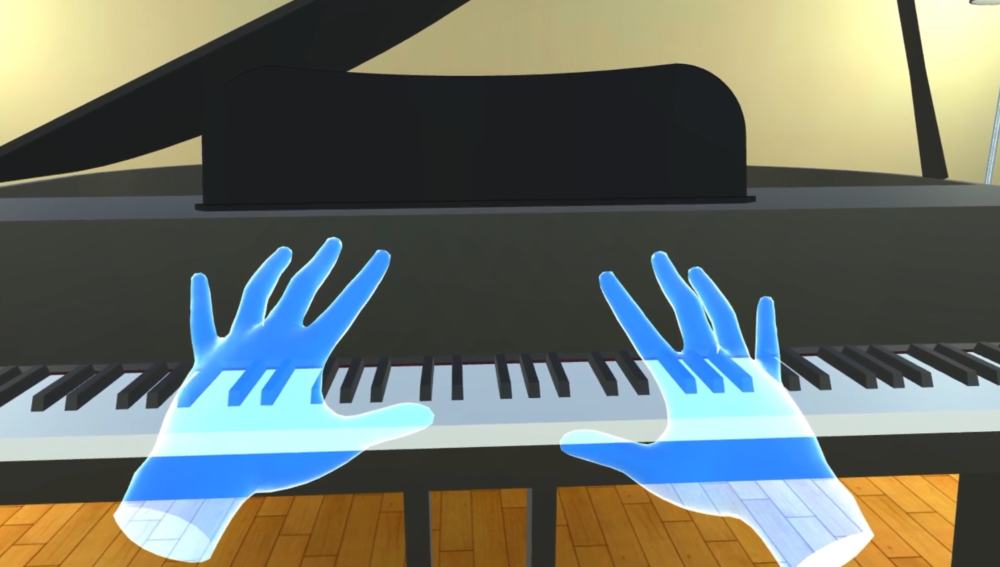
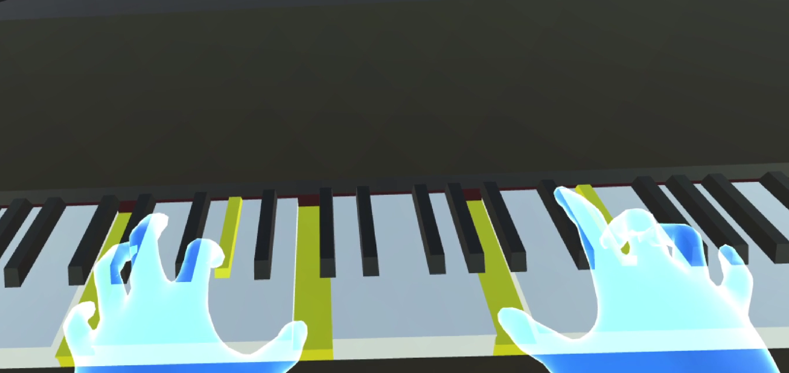
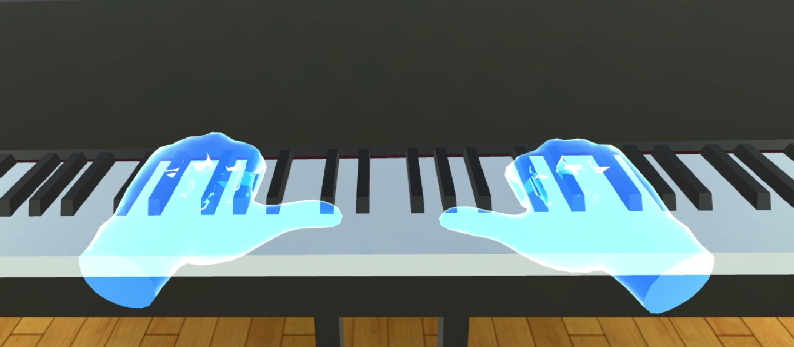
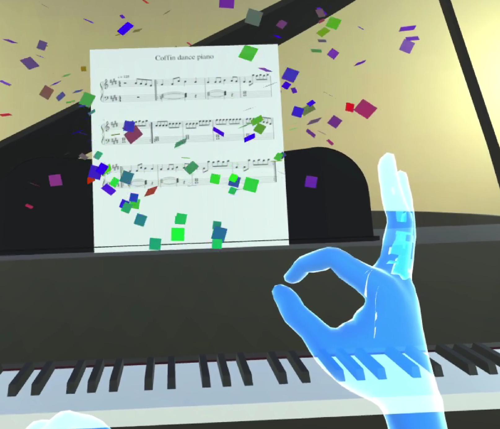
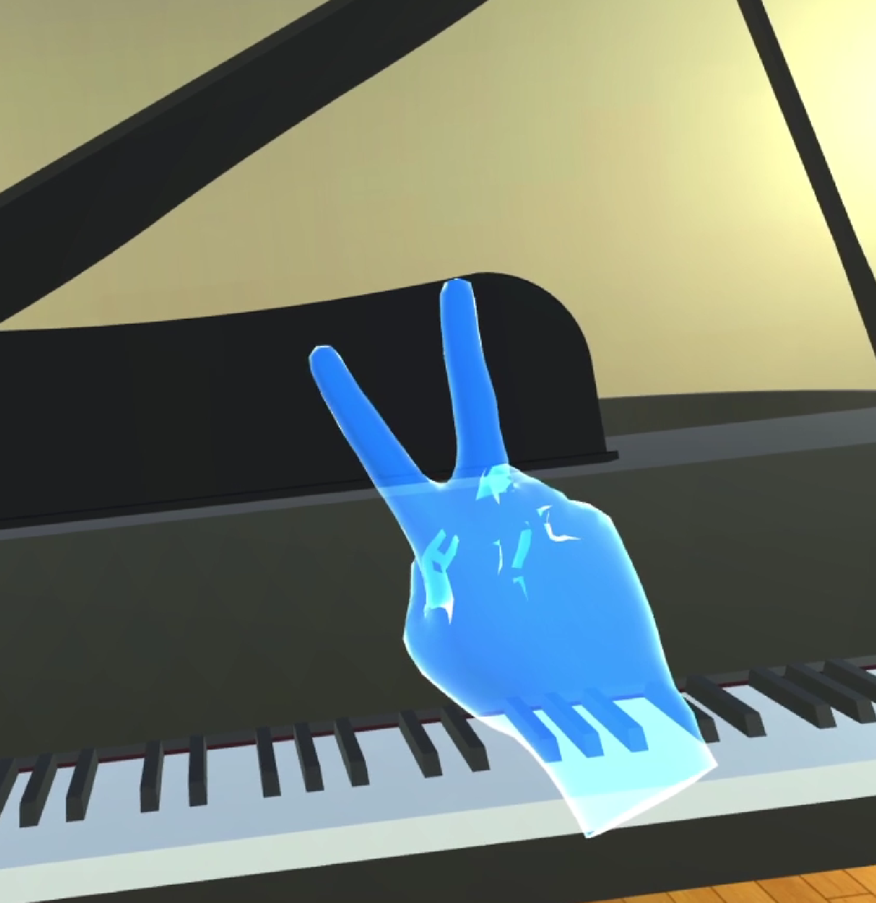

Welcome! 
This is a virtual piano developed in Unity 2019.4.10 for Oculus Quest to play with your hands!

Use each of your fingers to play different notes.

Put both of your hands in the following position to adjust piano's position.

To launch easter egg use the following gesture.

To close easter egg use the following gesture.

Enjoy!
